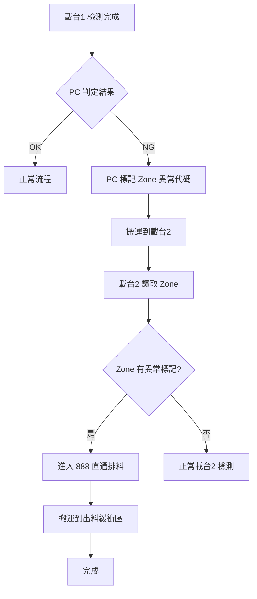
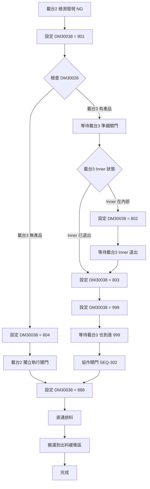
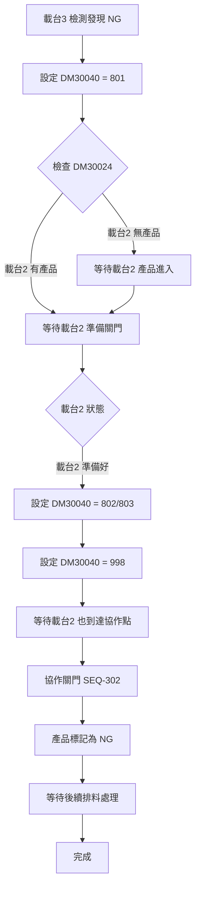
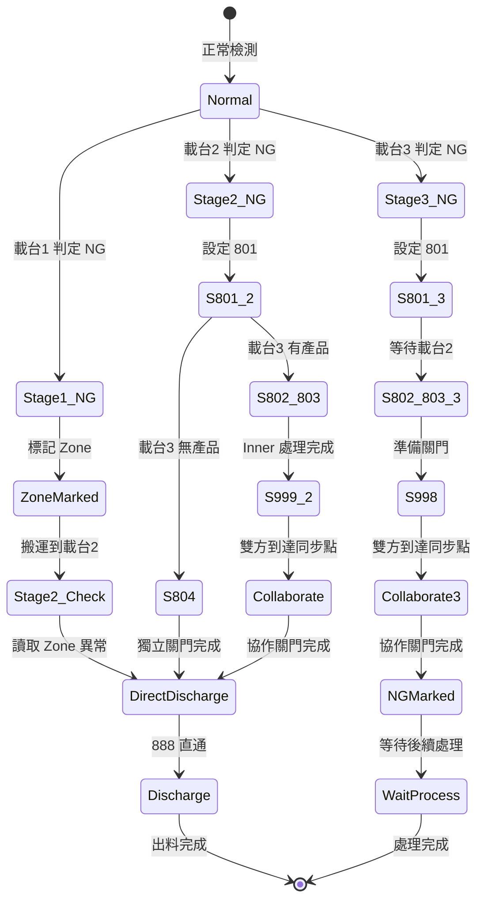

# 36. 單一產品排料流程

**文件版本**: v1.0
**最後更新**: 2025-12-12
**目標讀者**: PC 開發團隊、PLC 開發團隊

---

## 1. 概述

本文件定義當 PC 在檢測過程中判定產品 NG 時，觸發單一產品排料的完整流程。

### 1.1 適用情境

| 情境 | 說明 | 狀態碼 |
|------|------|--------|
| 載台1 異常 | 載台1 檢測發現 NG，標記 Zone 後直通排料 | - |
| 載台2 異常 | 載台2 檢測發現 NG，需與載台3 協作關門 | 801~804 |
| 載台3 異常 | 載台3 檢測發現 NG，需與載台2 協作關門 | 801~803 |

### 1.2 設計原則

- **Zone 標記優先**：異常產品在 Zone 區標記，供後續流程識別
- **協作機制**：載台2/3 異常時需協作關門
- **狀態碼復用**：關門後復用正常流程的 999/998/888 等狀態碼

---

## 2. 記憶體位址

### 2.1 狀態追蹤

| 位址 | 說明 |
|------|------|
| DM30024 | 載台2 工位追蹤 |
| DM30026 | 載台3 工位追蹤 |
| DM30038 | 載台2 狀態 |
| DM30040 | 載台3 狀態 |
| DM30076 | 當前處理的 Zone 編號（1~4）|

### 2.2 單一產品排料專用狀態碼

| 狀態碼 | 說明 |
|--------|------|
| 801 | 單一產品排料：等待對方準備關門 |
| 802 | 單一產品排料：載台3 Inner 退出中 |
| 803 | 單一產品排料：等待對方 Inner 退出完成 |
| 804 | 單一產品排料：載台2 獨立關門（載台3 無產品時）|

### 2.3 復用的正常流程狀態碼

| 狀態碼 | 說明 |
|--------|------|
| 999 | 同步點：等待對方到達關門準備位置 |
| 998 | 同步點：等待對方關門完成 |
| 888 | 直通排料狀態 |
| 992 | 搬運中（載台2→出料）|
| 991 | 搬運完成 |
| 555 | 完成狀態 |

---

## 3. 載台1 異常流程

### 3.1 流程說明

載台1 檢測發現 NG 時，最單純的情況：
1. PC 標記 Zone 區的異常代碼
2. 產品搬運到載台2
3. 載台2 讀取 Zone，發現異常標記
4. 進入 888 直通排料狀態，不做任何檢測

### 3.2 時序圖

```
載台1              PC                載台2
  |                 |                   |
  |-- 檢測完成 ---->|                   |
  |                 |-- 判定 NG         |
  |                 |-- 標記 Zone       |
  |                 |                   |
  |== 搬運到載台2 ====================>|
  |                 |                   |
  |                 |                   |-- 讀取 Zone
  |                 |                   |-- 發現異常標記
  |                 |                   |-- 進入 888 直通排料
  |                 |                   |
  |                 |                   |== 搬運到出料 ==>
```

### 3.3 流程圖



---

## 4. 載台2 異常流程

### 4.1 流程說明

載台2 檢測發現 NG 時，需考慮載台3 的狀態：

**情況 A：載台3 有產品**
- 需要與載台3 協作關門
- 使用 801→802→803→999→888 狀態流程

**情況 B：載台3 無產品**
- 載台2 獨立關門
- 使用 801→804→888 狀態流程

### 4.2 狀態轉換

```
載台2 有產品，載台3 有產品：
┌─────────────────────────────────────────────────────────┐
│  載台2: 801 → 等待載台3 準備 → 802/803 → 999 → 888     │
│  載台3: 正常流程 → 收到協作請求 → 999 → 998 → 繼續     │
└─────────────────────────────────────────────────────────┘

載台2 有產品，載台3 無產品：
┌─────────────────────────────────────────────────────────┐
│  載台2: 801 → 804 → 獨立關門 → 888                      │
└─────────────────────────────────────────────────────────┘
```

### 4.3 流程圖



### 4.4 協作時序（載台3 有產品）

```
載台2                              載台3
  |                                  |
  |-- DM30038=801 ------------------>|（通知準備）
  |                                  |
  |<-- 檢查 Inner 狀態 --------------|
  |                                  |
  |-- DM30038=802/803 -------------->|（等待 Inner）
  |                                  |
  |<-- Inner 退出完成 ---------------|
  |                                  |
  |-- DM30038=999 ------------------>|（同步點）
  |<-- DM30040=999 ------------------|
  |                                  |
  |======== 協作關門 SEQ-302 ========|
  |                                  |
  |-- DM30038=888 ------------------>|（直通排料）
  |                                  |-- 繼續正常流程
```

---

## 5. 載台3 異常流程

### 5.1 流程說明

載台3 檢測發現 NG 時，需與載台2 協作：

1. 載台3 設定 801 狀態
2. 等待載台2 到達可協作位置
3. 協作關門
4. 載台3 產品標記為 NG，等待後續處理

### 5.2 狀態轉換

```
┌─────────────────────────────────────────────────────────┐
│  載台3: 801 → 等待載台2 → 802/803 → 998 → 完成標記     │
│  載台2: 正常流程 → 收到協作請求 → 999 → 998 → 繼續     │
└─────────────────────────────────────────────────────────┘
```

### 5.3 流程圖



### 5.4 協作時序

```
載台3                              載台2
  |                                  |
  |-- DM30040=801 ------------------>|（通知準備）
  |                                  |
  |<-- 等待載台2 狀態 ---------------|
  |                                  |
  |-- DM30040=802/803 -------------->|（準備關門）
  |                                  |
  |-- DM30040=998 ------------------>|（同步點）
  |<-- DM30038=999/998 --------------|
  |                                  |
  |======== 協作關門 SEQ-302 ========|
  |                                  |
  |-- 標記 NG，等待處理 ------------>|
  |                                  |-- 繼續正常流程
```

---

## 6. 整體狀態機

### 6.1 狀態機圖



---

## 7. PC 實作要點

### 7.1 Zone 異常標記

```
當 PC 判定產品 NG 時：
1. 取得當前 Zone 編號（DM30076）
2. 寫入異常代碼到對應 Zone 的 +292~293 位址
3. 設定退料請求訊號（配合 Done 訊號）
```

### 7.2 監控要點

| 監控項目 | 位址 | 說明 |
|---------|------|------|
| 載台2 狀態 | DM30038 | 監控 801~804、999、888 |
| 載台3 狀態 | DM30040 | 監控 801~803、998 |
| Zone 編號 | DM30076 | 確認當前處理的 Zone |

### 7.3 錯誤處理

| 情況 | 處理方式 |
|------|---------|
| 協作 Timeout | 記錄錯誤，觸發警報 |
| Zone 標記失敗 | 重試或觸發警報 |
| 狀態不一致 | 記錄錯誤，等待人工介入 |

---

## 8. 相關文件

| 文件 | 內容 |
|------|------|
| 31.md | 動作序列（SEQ-005 單一產品退料、SEQ-301/302 開關門）|
| 51.md | 視覺拍照交握（退料訊號）|
| 52.md | 數據緩衝區（Zone 結構）|
| 54.md | 生產流程控制 |

---

## 附錄 A：狀態碼快查表

| 狀態碼 | 載台 | 說明 |
|--------|------|------|
| 801 | 2/3 | 等待對方準備關門 |
| 802 | 2/3 | 載台3 Inner 退出中 |
| 803 | 2/3 | 等待對方 Inner 退出完成 |
| 804 | 2 | 載台2 獨立關門（載台3 無產品）|
| 999 | 2 | 同步點：等待關門 |
| 998 | 3 | 同步點：等待關門 |
| 888 | 2 | 直通排料 |
| 992 | 2 | 搬運中 |
| 991 | 2 | 搬運完成 |
| 555 | 2/3 | 完成 |

---

## 附錄 B：決策樹

```
PC 判定產品 NG
├── 在載台1
│   └── 標記 Zone → 搬運 → 載台2 讀取 → 888 直通排料
│
├── 在載台2
│   ├── 載台3 有產品
│   │   └── 801 → 802/803 → 999 → 協作關門 → 888 → 出料
│   └── 載台3 無產品
│       └── 801 → 804 → 獨立關門 → 888 → 出料
│
└── 在載台3
    └── 801 → 802/803 → 998 → 協作關門 → 標記 NG → 等待處理
```
